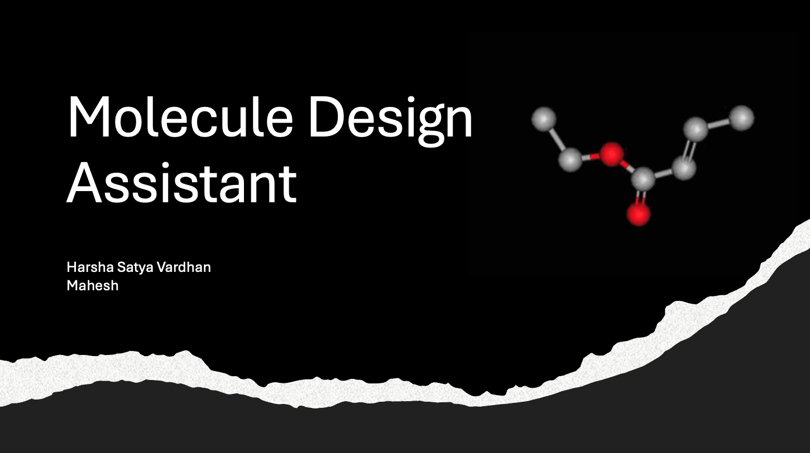
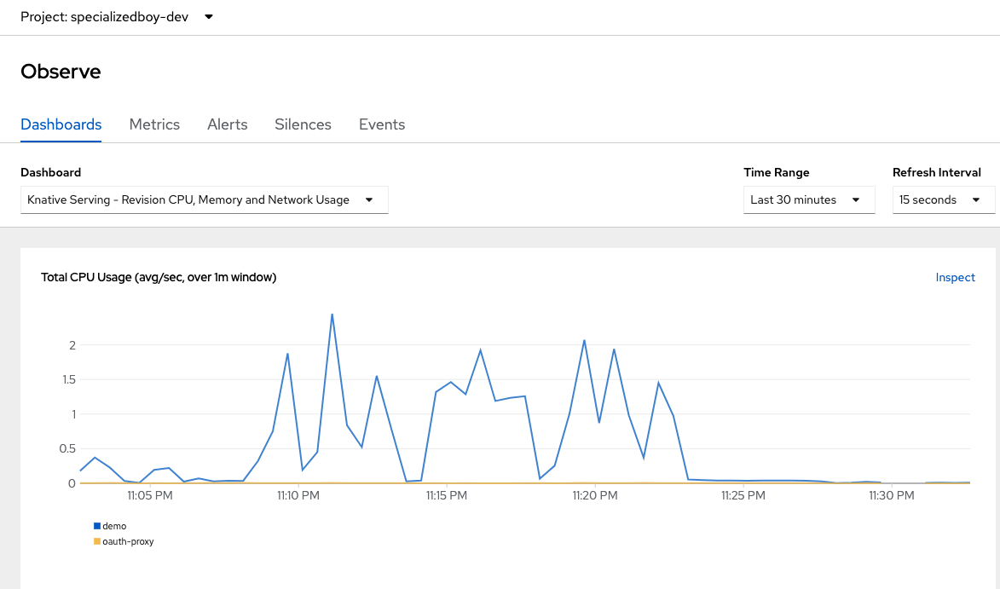
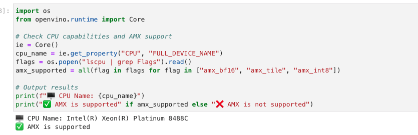

# Molecule Design Assistant 




- The **Project** folder contains the app code where the agents and tools are not openvino optimizer 

- To run the app follow the instructions 

- clone this repo
- cd chem-agent-intel
- install the virtual environment 
pip install virtualenv


virtualenv -p python3.10 intel

- activate the env

source intel/bin/activate


install all these packages in the environment 

```
pip install transformers 
pip install -U langchain-community
pip install rdkit-pypi 
pip install gradio
pip install langchain 
pip3 install torch torchvision torchaudio --index-url https://download.pytorch.org/whl/cpu
pip install sentencepiece
pip install -U langchain-community
pip install streamlit-shadcn-ui
pip install openvino-dev optimum-intel
pip install optimum[openvino,nncf] torchvision evaluate
```

- In the `main.py` file add your own `OPENAI API KEY`

then run streamlit app using the command 

- streamlit run main.py


## showing the usage of the Intel openvino and AMX






